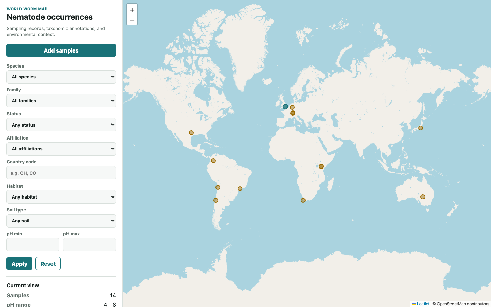

# World Worm Map (WWM)

World Worm Map (WWM) is a research software prototype for the collection, curation, and spatial exploration of nematode sampling records. The system is designed to support biodiversity and genomics workflows by linking field observations, sampling metadata, environmental descriptors, taxonomic annotations, and geographic context in a reproducible digital infrastructure.

The current MVP connects a KoboToolbox field form to a geospatial backend and an interactive web map. Sampling records can be ingested from KoboToolbox, stored in PostgreSQL/PostGIS, reviewed through API endpoints, and visualized on a Leaflet-based global map with filters for species, family, validation status, and institutional affiliation.

Public MVP demo: [World Worm Map web interface](https://lucyjimenez.github.io/world-worm-map/)



## Scientific Scope

WWM is intended as a foundation for a curated nematode occurrence and sampling database. The project follows the logic of an environmental data warehouse: preserve original field submissions, normalize core variables, track provenance, and expose the data through interfaces that support biological interpretation.

The MVP focuses on these scientific questions:

- Where have nematode samples been collected?
- Which species or provisional identifications are associated with each sampling site?
- Which institutions or research groups contributed each record?
- What environmental and soil descriptors are available for each site?

## MVP Capabilities

- KoboToolbox ingestion for field sampling submissions.
- PostgreSQL/PostGIS persistence for spatial records.
- Interactive Leaflet map for sample exploration.
- Filters by species, family, sample status, and affiliation.
- Sample-level metadata: country, site name, collector, date, tube ID, soil pH, depth, notes, and raw Kobo payload.
- Provisional species records created automatically for new samples.
- Governance endpoints for sample approval, species curation, and genomic accession links.
- Daily scheduled ingestion using APScheduler.

## Data Entry

New sampling records are entered through the active KoboToolbox collection form:

[WWM KoboToolbox sample submission form](https://ee-eu.kobotoolbox.org/x/HcREEDBq)

This keeps KoboToolbox as the source of truth for new submissions while WWM handles ingestion, normalization, curation, and spatial visualization.

What3Words is supported only as an optional internal field in KoboToolbox. GPS/PostGIS coordinates remain the canonical map location, and What3Words values are not displayed in the public map popup or public sample API response.

## Public Web Map

The public GitHub Pages map is available at:

[https://lucyjimenez.github.io/world-worm-map/](https://lucyjimenez.github.io/world-worm-map/)

The page is static and reads `wwm/frontend/demo-samples.json` as its public dataset. During deployment, GitHub Actions refreshes this file from KoboToolbox when the repository secret `KOBO_TOKEN` is configured. The deployment output combines sanitized Kobo submissions with a small set of beta reference samples that illustrate species, family, and curation-status filters. The public export is intentionally limited to coordinates, country, sampling site name, affiliation, date, habitat, soil, pH, depth, taxonomy, and beta curation status where available. It excludes What3Words, collector names, notes, raw Kobo payloads, original sample IDs, and internal Kobo identifiers.

The beta reference samples are stored in `wwm/frontend/reference-samples.json`. They are didactic records for MVP demonstration and should be replaced or flagged through a formal curation workflow when validated production taxonomy is available.

To enable live Kobo refresh in GitHub Pages, add this repository secret:

```text
KOBO_TOKEN=<kobotoolbox_api_token>
```

The workflow runs automatically every hour and can also be started manually from the repository Actions tab.

## Repository Structure

```text
wwm/
  backend/        FastAPI application, ingestion services, models, scripts
  frontend/       Leaflet web map
  forms/          Kobo/XLSForm artifacts
docs/             Architecture, API, schema, installation, handoff notes
forms/            XLSForm working files
docker-compose.yml
```

## Documentation

- [Installation Guide](docs/INSTALLATION.md)
- [MVP Handoff, Roadmap, and Implementation Notes](docs/MVP_HANDOFF.md)
- [Architecture](docs/ARCHITECTURE.md)
- [API Contract](docs/API.md)
- [Database Schema](docs/SCHEMA.md)
- [Kobo Field Mapping](docs/KOBO_FIELD_MAPPING.md)
- [Kobo Schema](docs/KOBO_SCHEMA.md)
- [Data Sources](docs/DATA_SOURCES.md)
- [Security Notes](docs/SECURITY.md)
- [SMART Implementation Plan](docs/SMART_PLAN.md)

## Attribution

Conceptual design and scientific direction were developed in collaboration with Worm Lab leadership.

Development, implementation, system integration, and delivery:
**Lucy Jimenez**

Developed for:
**Worm Lab** — https://worm-lab.eu/

Technology stack:
FastAPI, PostgreSQL/PostGIS, Leaflet, KoboToolbox, Docker Compose.
